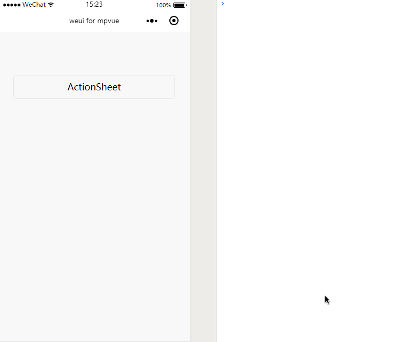

# ActionSheet
`ActionSheet`用于显示包含一系列可交互的动作集合，包括说明、跳转等。由底部弹出，一般用于响应用户对页面的点击。
如果在 H5 页面原生实现这个功能还是有点麻烦的，在小程序中就比较容易，直接调用 API `wx.showActionSheet()`就可以了，`mpvue`框架对微信的 API 支持的也十分完美，因此在`mpvue`中就可以这样实现：

``` vue
<template>
  <div class="page">
    <div class="page__bd">
      <div class="weui-btn-area">
        <button type="default" @click="open">ActionSheet</button>
      </div>
    </div>
  </div>
</template>

<script>
import base64 from '../../../static/images/base64';
export default {
  data() {
    return {
      itemList:['A', 'B', 'C']
    }
  },
  methods: {
    open() {
      let _this = this;
      wx.showActionSheet({
        itemList: this.itemList,
        success: function (res) {
          console.log("index：" + res.tapIndex, "用户选的值为：" + _this.itemList[res.tapIndex]);
        }
      });
    }
  }
}
</script>

<style>
page {
  margin-top: 50px;
  padding: 15px;
  box-sizing: border-box;
}
</style>

```
### 说两个比较重要的参数

#### itemList
* 类型：String Array
* 必填：是
* 说明：按钮的文字数组，数组长度最大为6个

#### success
* 类型：Function
* 必填：否
* 说明：接口调用成功的回调函数，详见返回参数说明


##### success 参数说明
**tapIndex**
* 类型：Number
* 说明：用户点击的按钮项目，在`itemList`中所对应的索引值

**tip**：可以用`res.tapIndex`可以获取用户点击值所对应的索引值。

**效果**


