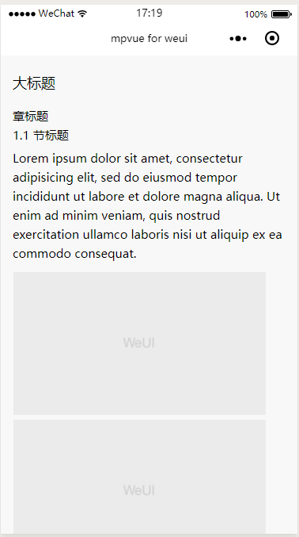

# Article
文章

这一节没有涉及到 api 这些，只是一些简单的样式，目的在于你可以快速的给一篇文章的不同部位加上样式。

``` vue
<div class="weui-article">
  <div class="weui-article__h1">大标题</div>
  <div class="weui-article__section">
    <div class="weui-article__title">章标题</div>
    <div class="weui-article__section">
      <div class="weui-article__h3">1.1 节标题</div>
      <div class="weui-article__p">
        Lorem ipsum dolor sit amet, consectetur adipisicing elit, sed do eiusmod tempor incididunt ut labore et dolore magna aliqua. Ut enim ad minim veniam, quis nostrud exercitation ullamco laboris nisi ut aliquip ex ea commodo consequat.
      </div>
      <div class="weui-article__p">
        <image class="weui-article__img" src="../../../static/images/pic_article.png" mode="aspectFit" style="height: 180px" />
        <image class="weui-article__img" src="../../../static/images/pic_article.png" mode="aspectFit" style="height: 180px" />
      </div>
    </div>
  </div>
</div>
```

通过示例代码应该可以看得很清楚了，文章一般就放在`weui-article`里面，然后大标题为`weui-article__h1`,文章有可能分为几个部分（`weui-article__section`），每部分又会有自己的标题（`weui-article__title`），下面就可能涉及到节标题（`weui-article__h3`）以及文章内容（`weui-article__p`），或者在文章内容里面插入一些
图片（`weui-article__img`）

**效果**


