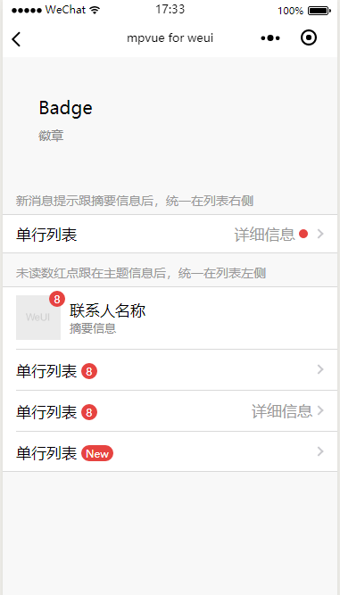

# Badage
徽章

#### 带文字的badge

``` vue
<span class="weui-badge">New</span>
```

#### 小红点

``` vue
<span class="weui-badge weui-badge_dot"></span>
```

#### 示例代码

``` vue
<template>
  <div class="page">
    <div class="page__hd">
        <div class="page__title">Badge</div>
        <div class="page__desc">徽章</div>
    </div>

    <div class="page__bd">
        <div class="weui-cells__title">新消息提示跟摘要信息后，统一在列表右侧</div>
        <div class="weui-cells weui-cells_after-title">
            <div class="weui-cell weui-cell_access">
                <div class="weui-cell__bd">单行列表</div>
                <div class="weui-cell__ft weui-cell__ft_in-access" style="font-size: 0">
                    <div style="display: inline-block;vertical-align:middle; font-size: 17px;">详细信息</div>
                    <div class="weui-badge weui-badge_dot" style="margin-left: 5px;margin-right: 5px;"></div>
                </div>
            </div>
        </div>

        <div class="weui-cells__title">未读数红点跟在主题信息后，统一在列表左侧</div>
        <div class="weui-cells weui-cells_after-title">
            <div class="weui-cell">
                <div class="weui-cell__hd" style="position: relative;margin-right: 10px;">
                    <image src="../../../static/images/pic_160.png" style="width: 50px; height: 50px; display: block"/>
                    <div class="weui-badge" style="position: absolute;top: -.4em;right: -.4em;">8</div>
                </div>
                <div class="weui-cell__bd">
                    <div>联系人名称</div>
                    <div style="font-size: 13px;color: #888888;">摘要信息</div>
                </div>
            </div>
            <div class="weui-cell weui-cell_access">
                <div class="weui-cell__bd">
                    <div style="display: inline-block; vertical-align: middle">单行列表</div>
                    <div class="weui-badge" style="margin-left: 5px;">8</div>
                </div>
                <div class="weui-cell__ft weui-cell__ft_in-access"></div>
            </div>
            <div class="weui-cell weui-cell_access">
                <div class="weui-cell__bd">
                    <div style="display: inline-block; vertical-align: middle">单行列表</div>
                    <div class="weui-badge" style="margin-left: 5px;">8</div>
                </div>
                <div class="weui-cell__ft weui-cell__ft_in-access">详细信息</div>
            </div>
            <div class="weui-cell weui-cell_access">
                <div class="weui-cell__bd">
                    <div style="display: inline-block; vertical-align: middle">单行列表</div>
                    <div class="weui-badge" style="margin-left: 5px;">New</div>
                </div>
                <div class="weui-cell__ft weui-cell__ft_in-access"></div>
            </div>
        </div>
    </div>
</div>
</template>

<script>
export default {

}
</script>

<style>

</style>

```

**效果**


