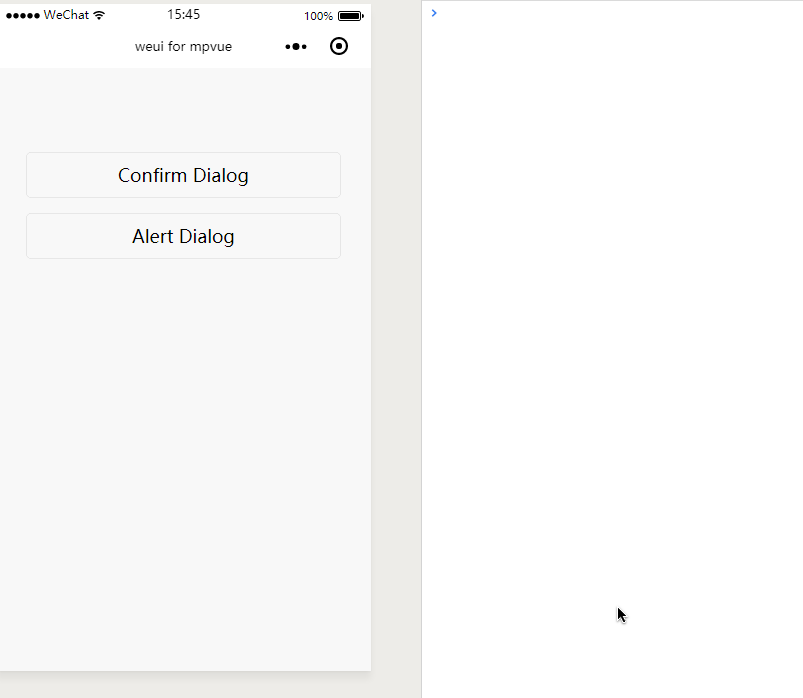

# Dialog
弹框

`Dialog`，也叫 “modal”，表现为带遮罩的弹框。可以分为 `Alert` 和 `Confirm` 两种。

实现这个功能调用微信 API `wx.showModal()` 即可，然后设置不同的参数就可以实现`Alert` 或者 `Confirm`，示例代码如下：

``` vue
<template>
  <div class="page">
    <div class="weui-btn-area">
      <button class="weui-btn" type="default" @click="openConfirm">Confirm Dialog</button>
      <button class="weui-btn" type="default" @click="openAlert">Alert Dialog</button>
    </div>
  </div>
</template>

<script>
import base64 from '../../../static/images/base64';
export default {
  data() {
    return {
    }
  },
  methods: {
    openConfirm() {
      wx.showModal({
        title: '弹窗标题',
        content: '弹窗内容，告知当前状态、信息和解决方法，描述文字尽量控制在三行内',
        confirmText: "主操作",
        cancelText: "辅助操作",
        success: function (res) {
          console.log(res);
          if (res.confirm) {
            console.log('用户点击主操作')
          } else {
            console.log('用户点击辅助操作')
          }
        }
      });
    },
    openAlert() {
      wx.showModal({
        content: '弹窗内容，告知当前状态、信息和解决方法，描述文字尽量控制在三行内',
        showCancel: false,
        success: function (res) {
          if (res.confirm) {
            console.log('用户点击确定')
          }
        }
      });
    }
  }
}
</script>

<style>
page {
  margin-top: 50px;
  padding: 15px;
  box-sizing: border-box;
}
</style>


```

**效果**


