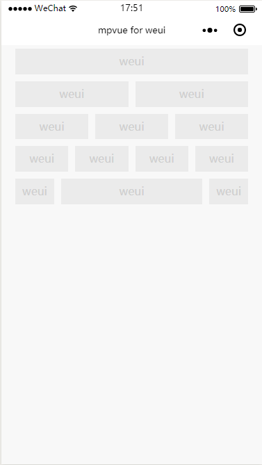

# Flex
flex 布局

`WeUI`提供了快速的 flex 布局


#### 示例代码
``` vue
<template>
  <div class="page">
    <div class="page__bd page__bd_spacing">
      <div class="weui-flex">
        <div class="weui-flex__item">
          <div class="placeholder">weui</div>
        </div>
      </div>
      <div class="weui-flex">
        <div class="weui-flex__item">
          <div class="placeholder">weui</div>
        </div>
        <div class="weui-flex__item">
          <div class="placeholder">weui</div>
        </div>
      </div>
      <div class="weui-flex">
        <div class="weui-flex__item">
          <div class="placeholder">weui</div>
        </div>
        <div class="weui-flex__item">
          <div class="placeholder">weui</div>
        </div>
        <div class="weui-flex__item">
          <div class="placeholder">weui</div>
        </div>
      </div>
      <div class="weui-flex">
        <div class="weui-flex__item">
          <div class="placeholder">weui</div>
        </div>
        <div class="weui-flex__item">
          <div class="placeholder">weui</div>
        </div>
        <div class="weui-flex__item">
          <div class="placeholder">weui</div>
        </div>
        <div class="weui-flex__item">
          <div class="placeholder">weui</div>
        </div>
      </div>
      <div class="weui-flex">
        <div>
          <div class="placeholder">weui</div>
        </div>
        <div class="weui-flex__item">
          <div class="placeholder">weui</div>
        </div>
        <div>
          <div class="placeholder">weui</div>
        </div>
      </div>
    </div>
  </div>
  </div>
</template>

<script>
export default {
  data() {
    return {
    }
  },
  methods: {

  }

}
</script>

<style>
.placeholder {
  margin: 5px;
  padding: 0 10px;
  text-align: center;
  background-color: #ebebeb;
  height: 2.3em;
  line-height: 2.3em;
  color: #cfcfcf;
}
</style>


```

从示例代码可以看出，首先需要在要进行`flex`布局的父元素上加上类 `weui-flex` ,然后将每个 `flex` 元素加上类 `weui-flex__item`即可。

**效果**


