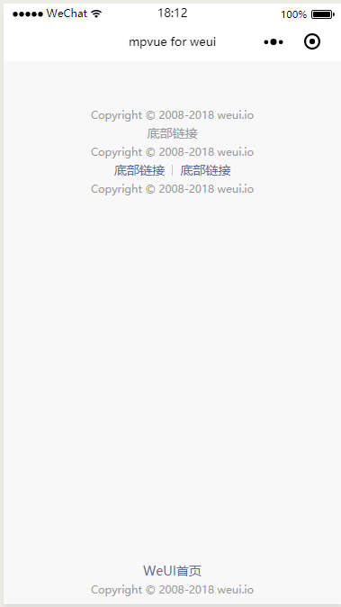

# Footer
`Footer`用于实现页脚，Copyright。
由于没有涉到 api 这些，因此就直接上示例代码了。

``` vue
 <div class="page">
    <div class="weui-footer">
      <div class="weui-footer__text">Copyright © 2008-2018 weui.io</div>
    </div>

    <div class="weui-footer">
      <div class="weui-footer__links">
        <navigator url="" class="weui-footer__link">底部链接</navigator>
      </div>
      <div class="weui-footer__text">Copyright © 2008-2018 weui.io</div>
    </div>

    <div class="weui-footer">
      <div class="weui-footer__links">
        <navigator url="" class="weui-footer__link">底部链接</navigator>
        <navigator url="" class="weui-footer__link">底部链接</navigator>
      </div>
      <div class="weui-footer__text">Copyright © 2008-2018 weui.io</div>
    </div>

    <div class="weui-footer weui-footer_fixed-bottom">
      <div class="weui-footer__links">
        <navigator url="" class="weui-footer__link">WeUI首页</navigator>
      </div>
      <div class="weui-footer__text">Copyright © 2008-2018 weui.io</div>
    </div>
</div>
```
从示例代码可以看出，如果只是需要单纯的底部文字样式,加上`weui-footer__text`即可，如果链接需要跳转的话，则需要加上`weui-footer__link`并使用`navigator`组件，如果是需要固定在底部的 `copyright`,加上`weui-footer_fixed-bottom`即可达到目的。

**效果**


