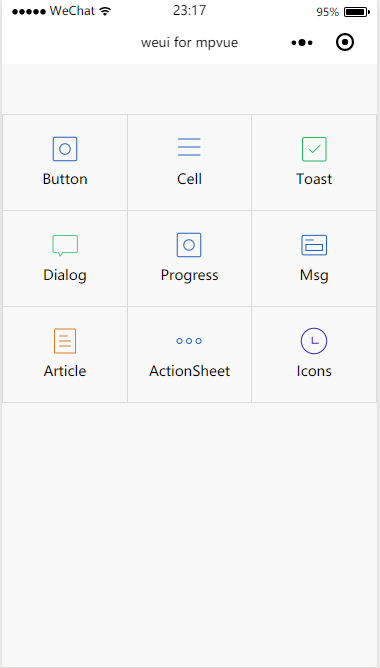

# Grid
`grid` 九宫格，功能类似于微信钱包界面中的九宫格，用于展示有多个相同级别的入口。包含功能的图标和简洁的文字描述。实现这个布局主要就是用了 `weui` 中的 `.weui-grid`,这种布局在 `mpvue`中也是完全支持的，示例代码如下：

``` vue
<template>
  <div class="page">
    <div class="page__bd">
      <div class="weui-grids">
        <block v-for="item in grids" :key="index">
          <navigator url="" class="weui-grid" hover-class="weui-grid_active">
            <image class="weui-grid__icon" :src="item.src" />
            <div class="weui-grid__label">{{item.name}}</div>
          </navigator>
        </block>
      </div>
    </div>
  </div>
</template>

<script>
import base64 from '../../../static/images/base64';
export default {
  data() {
    return {
      grids: [
        { src: '../../../static/images/icon_nav_button.png', name: 'Button' },
        { src: '../../../static/images/icon_nav_cell.png', name: 'Cell' },
        { src: '../../../static/images/icon_nav_toast.png', name: 'Toast' },
        { src: '../../../static/images/icon_nav_dialog.png', name: 'Dialog' },
        { src: '../../../static/images/icon_nav_button.png', name: 'Progress' },
        { src: '../../../static/images/icon_nav_panel.png', name: 'Msg' },
        { src: '../../../static/images/icon_nav_article.png', name: 'Article' },
        { src: '../../../static/images/icon_nav_actionSheet.png', name: 'ActionSheet' },
        { src: '../../../static/images/icon_nav_icons.png', name: 'Icons' }
      ]
    }
  },
  methods: {

  }
}
</script>

<style>
page {
  margin-top: 50px;
}
</style>

```

**效果**


