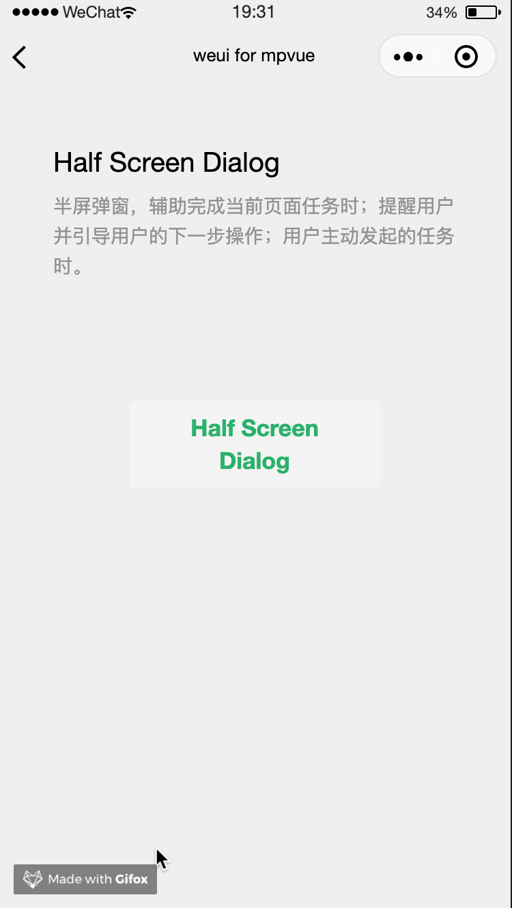

# Half-Screen-Dialog

半屏弹窗，辅助完成当前页面任务时；提醒用户并引导用户的下一步操作；用户主动发起的任务时。

示例代码如下：
``` vue
<div :class="['weui-demo-dialog', istrue ? 'weui-demo-dialog_show' : '']">
  <div class="weui-mask" @click="closeDialog"></div>
  <div class="weui-half-screen-dialog" catchtouchmove>
    <div class="weui-half-screen-dialog__hd">
      <div class="weui-half-screen-dialog__hd__side">
        <div @click="closeDialog" class="weui-icon-btn weui-icon-btn_close">关闭</div>
      </div>
      <div class="weui-half-screen-dialog__hd__main">
        <text class="weui-half-screen-dialog__title">标题</text>
        <text class="weui-half-screen-dialog__subtitle">标题</text>
      </div>
      <div class="weui-half-screen-dialog__hd__side">
        <div class="weui-icon-btn weui-icon-btn_more">更多</div>
      </div>
    </div>
    <div class="weui-half-screen-dialog__bd">
      <div class="weui-half-screen-dialog__desc">辅助描述内容，可根据实际需要安排</div>
      <div class="weui-half-screen-dialog__tips">辅助提示内容，可根据实际需要安排</div>
    </div>
    <div class="weui-half-screen-dialog__ft">
      <button type="default" class="weui-btn">辅助操作</button>
      <button type="primary" class="weui-btn">主操作</button>
    </div>
  </div>
</div>
```

**效果**

 