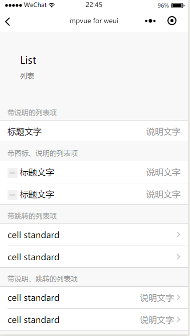

# 如何使用

## 引入 `WeUI.css`文件
利用 `vue init mpvue/mpvue-quickstart my-project` 初始化一个 `mpvue` 项目，然后在 `/src/main.js` 中引入 `weui.css`

?> 由于是在小程序中使用，于是就直接使用了 [weiui-wxss](https://github.com/Tencent/weui-wxss/)中的样式文件,官方提供的是`weui.wxss`,因此手动转成了`weui.css`,然后引入即可。

这里提供**weui.css**一个链接：[KuangPF/mpvue-weui](https://github.com/KuangPF/mpvue-weui/blob/master/static/weui/weui.css)

## 使用

**这里 cell 为例**：

Cell，列表视图，用于将信息以列表的结构显示在页面上，是移动端上最常用的内容结构。Cell由多个section组成，每个 section 包括 section header `weui-cells__title` 以及 cells `weui-cells`。

cell 由 thumbnail(图标) `weui-cell__hd`、body(标题文字) `weui-cell__bd`、accessory(说明文字) `weui-cell__ft`三部分组成，其中weui-cell__bd采用自适应布局。

