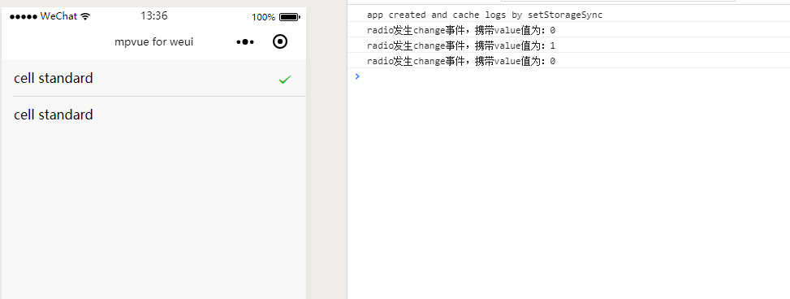
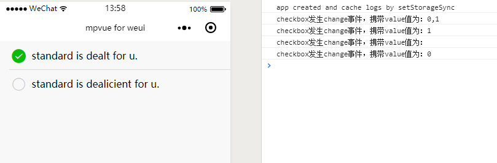
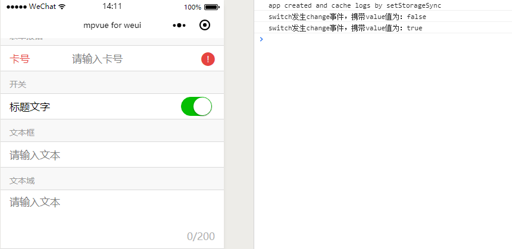

# Input
输入框

## radio-group
单项选择器，内部由多个`<radio/>`组成。

##### bindchange
* 类型：EventHandle
* 默认值：无
* 说明：`<radio-group/>` 中的选中项发生变化时触发 change 事件，`event.mp.detail = {value: 选中项radio的value}`

## radio
单选项目

#### 在`mpvue`框架中使用

``` vue
<template>
  <div class="page">
    <radio-group @change="radioChange">
      <label class="weui-cell weui-check__label" v-for="item in radioItems" :key="index">
        <radio class="weui-check" :value="item.value" :checked="item.checked" />
        <div class="weui-cell__bd">{{item.name}}</div>
        <div class="weui-cell__ft weui-cell__ft_in-radio" v-if="item.checked">
          <icon class="weui-icon-radio" type="success_no_circle" size="16"></icon>
        </div>
      </label>
    </radio-group>
  </div>
  </div>
</template>

<script>
export default {
  data() {
    return {
      radioItems: [
        { name: 'cell standard', value: '0' },
        { name: 'cell standard', value: '1', checked: true }
      ],
    }
  },
  methods: {
    radioChange(e) {
      console.log('radio 携带的值为：' + e.mp.detail.value);
      let radioItems = this.radioItems;
      for (let i = 0; i < radioItems.length; ++i) {
        radioItems[i].checked = radioItems[i].value === e.mp.detail.value;
      }
      this.radioItems = radioItems;
    }
  }

}
</script>

<style>
.nones {
  color: red;
}
</style>

```


##### 踩坑
!> 1.`<radio-group>`中的`bindchange`要写成`@change="radioChange"`

!> 2.`<radio>`中的`value`要写成` :value="item.value"`,`checked`要写成 `:checked="item.checked"`，vue 中数据绑定的写法

!> 3.`radioChange`返回选中值获取方法为：`e.mp.detail.value`,而小程序中的写法是`e.detail.value`


## checkbox-group
多项选择器，内部由多个`checkbox`组成。

##### bindchange
* 类型：EventHandle
* 默认值：无
* 说明：`<checkbox-group/>`中选中项发生改变是触发 change 事件，`mp.detail = {value:[选中的checkbox的value的数组]}`

## checkbox
多选项目。

``` vue
<template>
  <div class="page">
    <checkbox-group @change="checkboxChange">
      <label class="weui-cell weui-check__label" v-for="item in checkboxItems" :key="index">
        <checkbox class="weui-check" :value="item.value" :checked="item.checked" />
        <div class="weui-cell__hd weui-check__hd_in-checkbox">
          <icon class="weui-icon-checkbox_circle" type="circle" size="23" v-if="!item.checked"></icon>
          <icon class="weui-icon-checkbox_success" type="success" size="23" v-if="item.checked"></icon>
        </div>
        <div class="weui-cell__bd">{{item.name}}</div>
      </label>
    </checkbox-group>
  </div>
  </div>
</template>

<script>
export default {
  data() {
    return {
      checkboxItems: [
        { name: 'standard is dealt for u.', value: '0', checked: true },
        { name: 'standard is dealicient for u.', value: '1', checked: false }
      ],
    }
  },
  methods: {
    checkboxChange(e) {
      console.log('checkbox发生change事件，携带value值为：' + e.mp.detail.value);
      var checkboxItems = this.checkboxItems, values = e.mp.detail.value;
      for (var i = 0, lenI = checkboxItems.length; i < lenI; ++i) {
        checkboxItems[i].checked = false;

        for (var j = 0, lenJ = values.length; j < lenJ; ++j) {
          if (checkboxItems[i].value == values[j]) {
            checkboxItems[i].checked = true;
            break;
          }
        }
      }
      this.checkboxItems = checkboxItems;
    }
  }

}
</script>

<style>
.nones {
  color: red;
}
</style>
```



##### 踩坑
!> 与`radio`差不多，都是一些写法的问题，看下示例代码应该就可以明白。

## switch
开关选择器。

##### bindchange
* 类型：EventHandle
* 默认值：无
* 说明：`checked` 改变时触发 `change` 事件，`event.mp.detail={ value:checked}`

``` vue
<template>
  <div class="page">
    <div class="weui-cells__title">开关</div>
      <div class="weui-cells weui-cells_after-title">
        <div class="weui-cell weui-cell_switch">
          <div class="weui-cell__bd">标题文字</div>
          <div class="weui-cell__ft">
            <switch checked @change = "switchChange"/>
          </div>
        </div>
      </div>
  </div>
  </div>
</template>

<script>
export default {
  data() {
    return {

    }
  },
  methods: {
    switchChange(e) {
      console.log("switch发生change事件，携带value值为："+ e.mp.detail.value);
    }
  }

}
</script>

<style>
.nones {
  color: red;
}
</style>
```



##### 踩坑
!> 与`radio`和`checkbox`差不多，都是一些写法的问题，看下示例代码应该就可以明白。

<!-- ##### value
* 类型：String
* 默认值：无
* 说明：`<radio/>` 标识。当该`<radio/>` 选中时，`<radio-group/>` 的 change 事件会携带`<radio/>`的value

##### checked
* 类型：Boolean
* 默认值：false
* 说明：当前是否选中

##### disabled
* 类型：Boolean
* 默认值：false
* 说明：是否禁用

##### checked
* 类型：Color
* 默认值：无
* 说明：radio的颜色，同css的color
 -->
