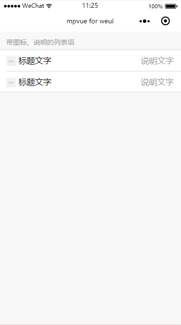
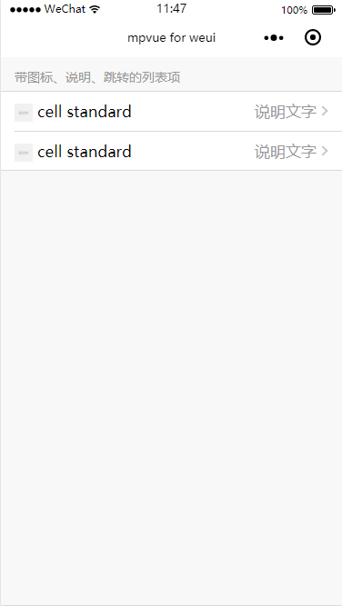

# List
列表

在 `WeUI` 用 Cell 来显示列表视图，用于将信息以列表的结构显示在页面上。Cell由多个section组成，每个 section 包括 section header `weui-cells__title` 以及 cells `weui-cells`。

cell 由 thumbnail(图标) `weui-cell__hd`、body(标题文字) `weui-cell__bd`、accessory(说明文字) `weui-cell__ft`三部分组成，其中weui-cell__bd采用自适应布局。


### 普通列表项
``` html
<div class="weui-cells__title">带图标、说明的列表项</div>
<div class="weui-cells weui-cells_after-title">
    <div class="weui-cell">
      <div class="weui-cell__hd">
        <image :src="icon" style="margin-right: 5px;vertical-align: middle;width:20px; height: 20px;"></image>
      </div>
      <div class="weui-cell__bd">标题文字</div>
      <div class="weui-cell__ft">说明文字</div>
    </div>
    <div class="weui-cell">
      <div class="weui-cell__hd">
        <image :src="icon" style="margin-right: 5px;vertical-align: middle;width:20px; height: 20px;"></image>
      </div>
      <div class="weui-cell__bd">标题文字</div>
      <div class="weui-cell__ft">说明文字</div>
    </div>
</div>
```
**效果**：




从图中可以看出最外面的 cell 有1个 section 组成，这个 section 包含了 section header（带图标、说明的列表项），以及 cells （有两个cell）。cells 下的每个 cell 包含了 thumbnail(图标)，body(标题文字)，accessory(说明文字)。从而构成了一个完整的列表视图。


### 带跳转功能的列表项

``` html
<div class="weui-cells__title">带跳转的列表项</div>
  <div class="weui-cells weui-cells_after-title">
    <navigator url="" class="weui-cell weui-cell_access" hover-class="weui-cell_active">
      <div class="weui-cell__bd">cell standard</div>
      <div class="weui-cell__ft weui-cell__ft_in-access"></div>
    </navigator>
    <navigator url="" class="weui-cell weui-cell_access" hover-class="weui-cell_active">
      <div class="weui-cell__bd">cell standard</div>
      <div class="weui-cell__ft weui-cell__ft_in-access"></div>
    </navigator>
</div>
```

**效果**：



如果要实现带跳转的列表项，只需要在每个 cells 下的每个 cell 最外层套上一个 navigator 组件,并加上一个 `weui-cell_access` 类名。要出现一个跳转箭头，在 accessory(说明文字)部分加上 `weui-cell__ft_in-access`类名。

