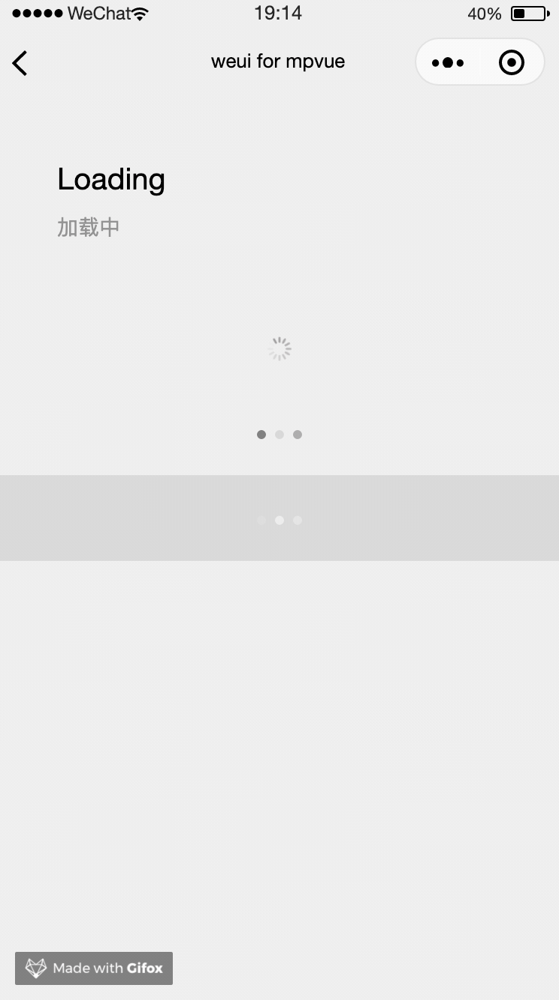

# Loading

加载中

示例代码如下：

``` vue
<div class="weui-loading__wrp">
  <div class="weui-loading"></div>
</div>
<div class="weui-loading__wrp">
  <div class="loading wx_dot_loading"></div>
</div>
<div class="weui-loading__wrp">
  <div class="loading wx_dot_loading wx_dot_loading_white"></div>
</div>
```

**效果**

