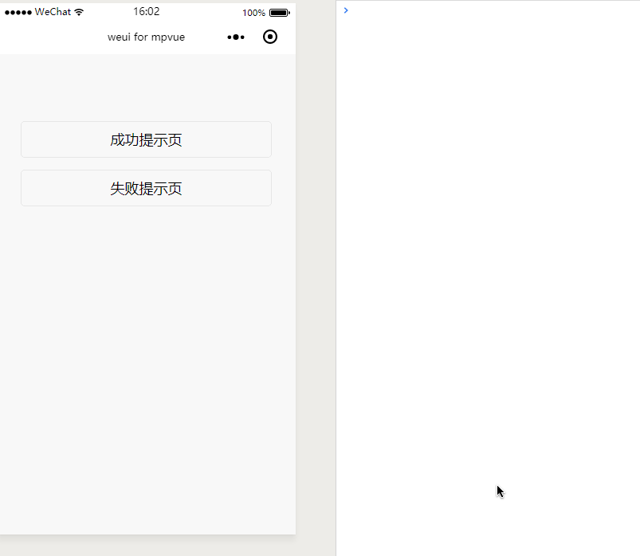

# Msg
结果页

结果页通常来说可以认为进行一系列操作步骤后，作为流程结束的总结性页面。结果页的作用主要是告知用户操作处理结果以及必要的相关细节（可用于确认之前的操作是否有误）等信息；若该流程用于开启或关闭某些重要功能，可在结果页增加与该功能相关的描述性内容。

实现这个功能比较容易，使用微信 API `wx.navigateTo()`即可，`mpvue`框架中示例代码如下：

``` vue
<template>
  <div class="page">
    <div class="weui-btn-area">
      <button class="weui-btn" type="default" @click="openSuccess">成功提示页</button>
      <button class="weui-btn" type="default" @click="openFail">失败提示页</button>
    </div>
  </div>
</template>

<script>
import base64 from '../../../static/images/base64';
export default {
  data() {
    return {
    }
  },
  methods: {
    openSuccess() {
      wx.navigateTo({
        url: '../msg-success/msg-success'
      })
    },
    openFail: function () {
      wx.navigateTo({
        url: '../msg-fail/msg-fail'
      })
    }
  }
}
</script>

<style>
page {
  margin-top: 50px;
  padding: 15px;
  box-sizing: border-box;
}
</style>

```

**效果**


