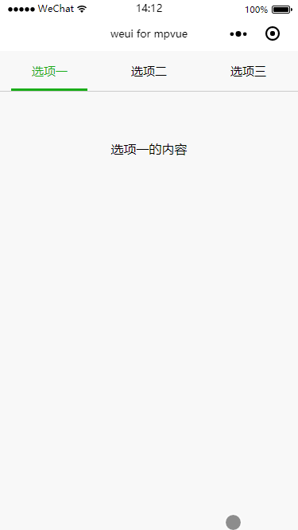

# Navbar
顶部导航

顶部 `tab`，当需要在页面顶部展示 `tab` 导航时使用，实现这个效果主要有两个地方要注意一下：
* 顶部点击后有颜色的改变以及有过度效果
* 顶部点击后下面对应部分也要发生改变

先看在`mpvue`中实现的示例代码：

```
<template>
  <div class="page">
    <div class="page__bd">
      <div class="weui-tab">
        <div class="weui-navbar">
          <block v-for="(item,index) in tabs" :key="index">
            <div :id="index" :class="{'weui-bar__item_on':activeIndex == index}" class="weui-navbar__item" @click="tabClick">
              <div class="weui-navbar__title">{{item}}</div>
            </div>
          </block>
          <div class="weui-navbar__slider" :class="navbarSliderClass"></div>
        </div>
        <div class="weui-tab__panel">
          <div class="weui-tab__content" :hidden="activeIndex != 0">选项一的内容</div>
          <div class="weui-tab__content" :hidden="activeIndex != 1">选项二的内容</div>
          <div class="weui-tab__content" :hidden="activeIndex != 2">选项三的内容</div>
        </div>
      </div>
    </div>
  </div>
</template>

<script>
export default {
  data() {
    return {
      tabs: ["选项一", "选项二", "选项三"],
      activeIndex: 0,
      fontSize: 30
    }
  },
  computed: {
    navbarSliderClass() {
      if (this.activeIndex == 0) {
        return 'weui-navbar__slider_0'
      }
      if (this.activeIndex == 1) {
        return 'weui-navbar__slider_1'
      }
      if (this.activeIndex == 2) {
        return 'weui-navbar__slider_2'
      }
    }
  },
  methods: {
    tabClick(e) {
      console.log(e);
      this.activeIndex = e.currentTarget.id;
    }
  }
}
</script>

<style scoped>
page,
.page,
.page__bd {
  height: 100%;
}
.page__bd {
  padding-bottom: 0;
}
.weui-tab__content {
  padding-top: 60px;
  text-align: center;
}
.weui-navbar__slider_0 {
  left: 29rpx;
  transform: translateX(0);
}
.weui-navbar__slider_1 {
  left: 29rpx;
  transform: translateX(250rpx);
}
.weui-navbar__slider_2 {
  left:29rpx;
  transform: translateX(500rpx);
}
</style>

```
从示例代码中可以看出，每次点击 `tab`，会触发一个 `event`事件，从这个事件中，通过 `e.currentTarget.id`可以获取点击`tab`上绑定的 `id`值，再根据`:class`来判断要不要显示 `weui-bar__item_on`类。对于下面绿色的滑动条过渡效果是通过 CSS3 属性`transform: translateX()`来实现，依赖 `vue`的 `computed` 属性，通过`e.currentTarget.id`来判断确定需要`translateX`的值，从而对应添加相应的类。当`tab`切换时，下面内容展示区也是根据`e.currentTarget.id`来控制显示与隐藏。


**效果**


