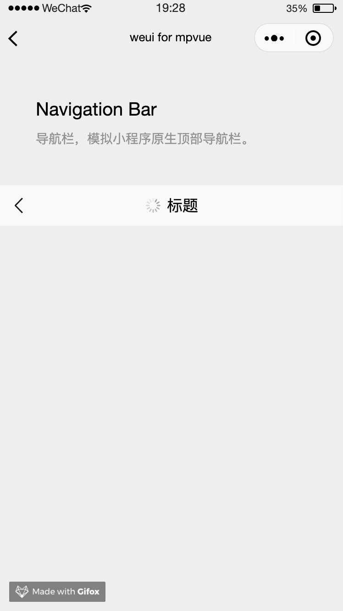

# Navigation-Bar

导航栏，模拟小程序原生顶部导航栏。

示例代码如下：
``` vue
<template>
  <div class="page">
    <div class="page__hd">
      <div class="page__title">Navigation Bar</div>
      <div class="page__desc">导航栏，模拟小程序原生顶部导航栏。</div>
    </div>
    <div class="page__bd">
      <div class="weui-navigation-bar">
        <div class="weui-navigation-bar__placeholder" style="visible: hidden;"></div>
        <div class="weui-navigation-bar__inner">
          <div class="weui-navigation-bar__left">
            <div class="weui-navigation-bar__buttons">
              <div
                @click="back"
                class="weui-navigation-bar__button weui-navigation-bar__btn_goback"
              ></div>
            </div>
          </div>

          <div class="weui-navigation-bar__center">
            <div class="weui-navigation-bar__loading">
              <div class="weui-loading"></div>
            </div>
            <text>标题</text>
          </div>

          <div class="weui-navigation-bar__right"></div>
        </div>
      </div>
    </div>
  </div>
</template>

<script>
export default {
  methods: {
    back() {
      wx.navigateBack()
    }
  }
}
</script>

<style scoped>
.weui-navigation-bar {
  position: relative;
}
.weui-navigation-bar__inner {
  position: absolute;
}
</style>

```


**效果**

