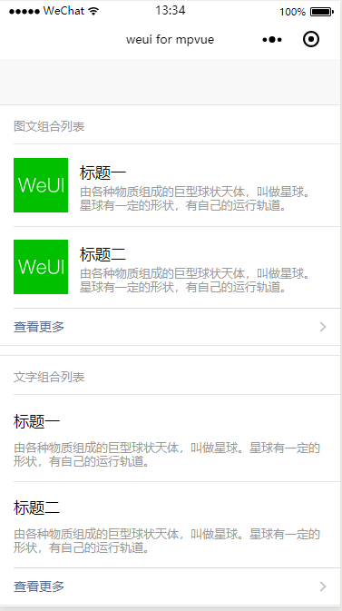

# Panel
面板

Panel（`weui-panel`）由head（可选）、body、foot（可选）三部分组成，主要承载了图文组合列表`weui-media-box_appmsg`、文字组合列表`weui-media-box_text`以及小图文组合列表`weui-media-box_small-appmsg`。
body部分根据不同业务可自定义不同的内容。foot部分默认支持“查看更多”的样式，需要在`weui-panel`扩展一个`weui-panel_access`的类。

图文组合列表：包括封面图、标题与描述，封面图居左，与文字垂直居中对齐，示例代码如下：

``` vue
<template>
  <div class="page">
    <div class="page__hd">
      <div class="page__title">Panel</div>
      <div class="page__desc">面板</div>
    </div>
    <div class="page__bd">
      <!-- 图文组合列表  start -->
      <div class="weui-panel weui-panel_access">
        <div class="weui-panel__hd">图文组合列表</div>
        <div class="weui-panel__bd">
          <navigator url="" class="weui-media-box weui-media-box_appmsg" hover-class="weui-cell_active">
            <div class="weui-media-box__hd weui-media-box__hd_in-appmsg">
              <image class="weui-media-box__thumb" :src="icon60" />
            </div>
            <div class="weui-media-box__bd weui-media-box__bd_in-appmsg">
              <div class="weui-media-box__title">标题一</div>
              <div class="weui-media-box__desc">由各种物质组成的巨型球状天体，叫做星球。星球有一定的形状，有自己的运行轨道。</div>
            </div>
          </navigator>
          <navigator url="" class="weui-media-box weui-media-box_appmsg" hover-class="weui-cell_active">
            <div class="weui-media-box__hd weui-media-box__hd_in-appmsg">
              <image class="weui-media-box__thumb" :src="icon60" />
            </div>
            <div class="weui-media-box__bd weui-media-box__bd_in-appmsg">
              <div class="weui-media-box__title">标题二</div>
              <div class="weui-media-box__desc">由各种物质组成的巨型球状天体，叫做星球。星球有一定的形状，有自己的运行轨道。</div>
            </div>
          </navigator>
        </div>
        <div class="weui-panel__ft">
          <div class="weui-cell weui-cell_access weui-cell_link">
            <div class="weui-cell__bd">查看更多</div>
            <div class="weui-cell__ft weui-cell__ft_in-access"></div>
          </div>
        </div>
      </div>
      <!-- 图文组合列表  end -->

      <!-- 文字组合列表  start -->
      <div class="weui-panel weui-panel_access">
        <div class="weui-panel__hd">文字组合列表</div>
        <div class="weui-panel__bd">
          <div class="weui-media-box weui-media-box_text">
            <div class="weui-media-box__title weui-media-box__title_in-text">标题一</div>
            <div class="weui-media-box__desc">由各种物质组成的巨型球状天体，叫做星球。星球有一定的形状，有自己的运行轨道。</div>
          </div>
          <div class="weui-media-box weui-media-box_text">
            <div class="weui-media-box__title weui-media-box__title_in-text">标题二</div>
            <div class="weui-media-box__desc">由各种物质组成的巨型球状天体，叫做星球。星球有一定的形状，有自己的运行轨道。</div>
          </div>
        </div>
        <div class="weui-panel__ft">
          <div class="weui-cell weui-cell_access weui-cell_link">
            <div class="weui-cell__bd">查看更多</div>
            <div class="weui-cell__ft weui-cell__ft_in-access"></div>
          </div>
        </div>
      </div>
      <!-- 文字组合列表  end -->

      <!-- 小图文组合列表  start -->
      <div class="weui-panel">
        <div class="weui-panel__hd">小图文组合列表</div>
        <div class="weui-panel__bd">
          <div class="weui-media-box weui-media-box_small-appmsg">
            <div class="weui-cells weui-cells_in-small-appmsg">
              <navigator url="" class="weui-cell weui-cell_access" hover-class="weui-cell_active">
                <div class="weui-cell__hd">
                  <image :src="icon20" style="width: 20px;height: 20px;margin-right: 5px" />
                </div>
                <div class="weui-cell__bd weui-cell_primary">
                  <div>文字标题</div>
                </div>
                <div class="weui-cell__ft weui-cell__ft_in-access"></div>
              </navigator>
              <navigator url="" class="weui-cell weui-cell_access" hover-class="weui-cell_active">
                <div class="weui-cell__hd">
                  <image :src="icon20" style="width: 20px;height: 20px;margin-right: 5px" />
                </div>
                <div class="weui-cell__bd weui-cell_primary">
                  <div>文字标题</div>
                </div>
                <div class="weui-cell__ft weui-cell__ft_in-access"></div>
              </navigator>
            </div>
          </div>
        </div>
      </div>
      <!-- 小图文组合列表 end -->

      <!-- 文字列表附来源 start -->
      <div class="weui-panel">
        <div class="weui-panel__hd">文字列表附来源</div>
        <div class="weui-panel__bd">
          <div class="weui-media-box weui-media-box_text">
            <div class="weui-media-box__title weui-media-box__title_in-text">标题一</div>
            <div class="weui-media-box__desc">由各种物质组成的巨型球状天体，叫做星球。星球有一定的形状，有自己的运行轨道。</div>
            <div class="weui-media-box__info">
              <div class="weui-media-box__info__meta">文字来源</div>
              <div class="weui-media-box__info__meta">时间</div>
              <div class="weui-media-box__info__meta weui-media-box__info__meta_extra">其它信息</div>
            </div>
          </div>
        </div>
      </div>
      <!-- 文字列表附来源 end -->
    </div>
  </div>
</template>

<script>
import base64 from '../../../static/images/base64';
export default {
  data() {
    return {
      icon20: base64.icon20,
      icon60: base64.icon60
    }
  }
}
</script>

<style>

</style>

```

**效果**


