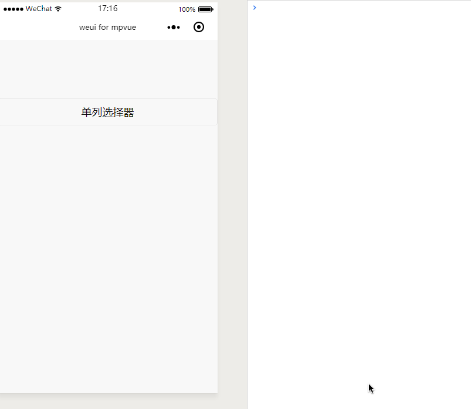
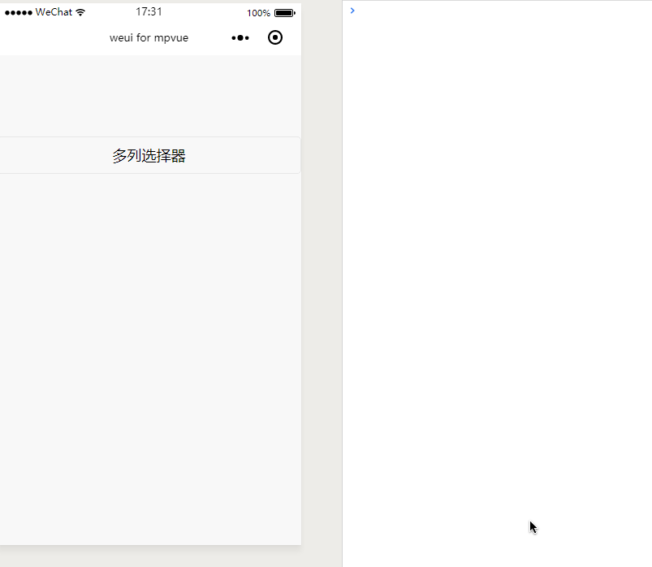
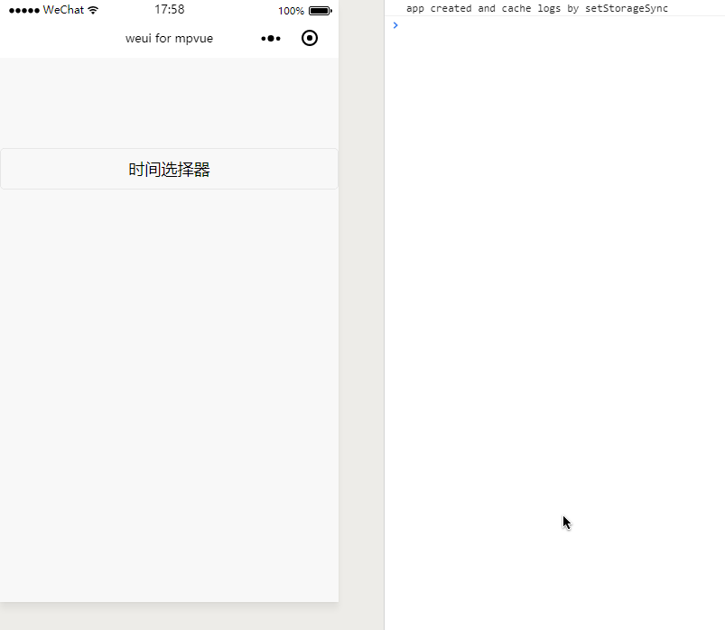
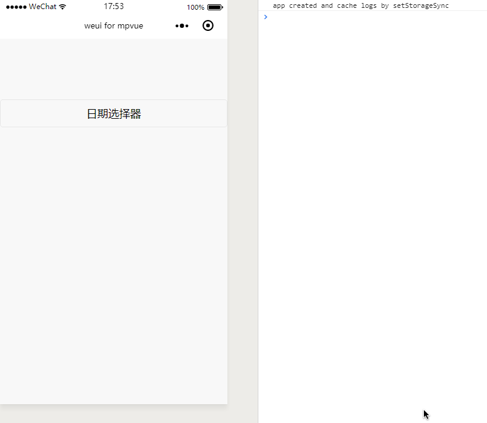
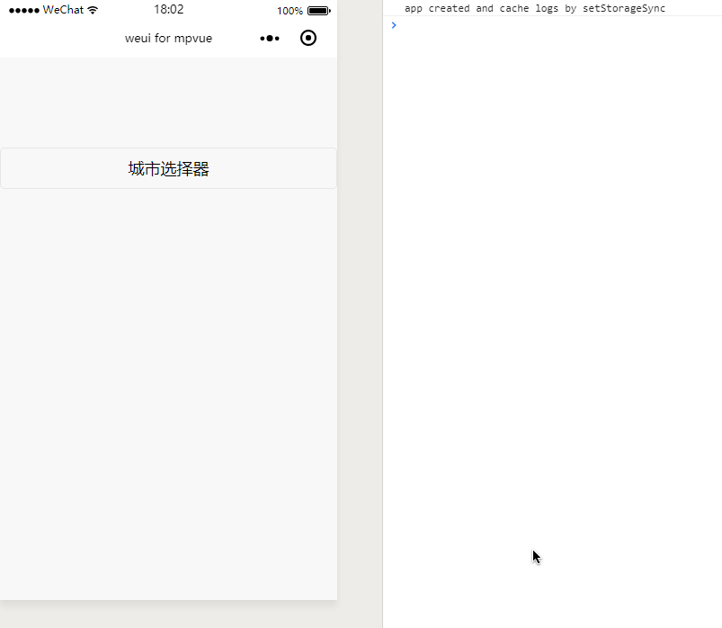
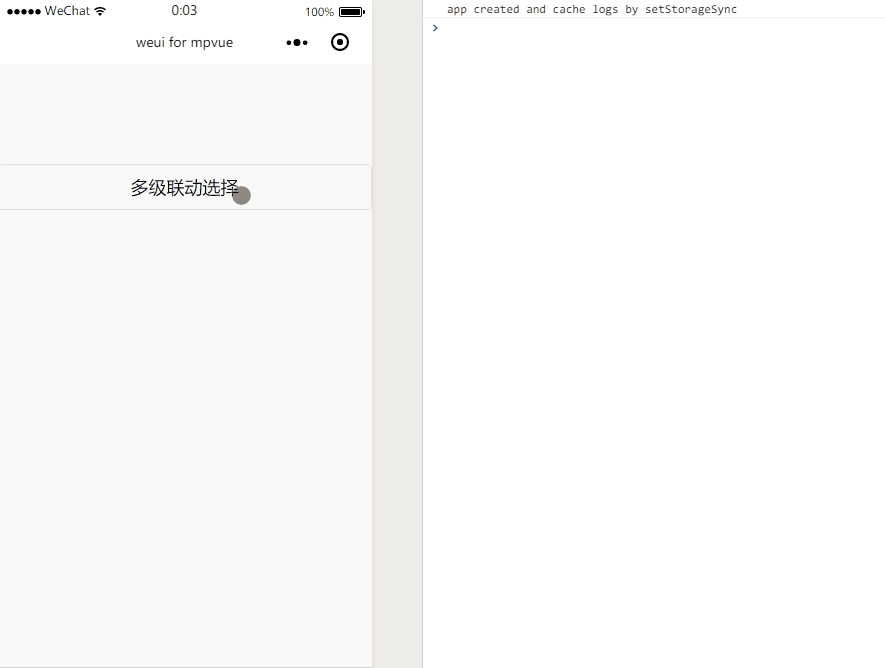

# Picker
选择器

选择器不管是在 H5 页面还是小程序中使用的都非常多，`mpvue`框架对选择器的支持也非常好，下面将一一介绍各个类型选择器在 `mpvue`中的应用。

**统一声明**：实现这些选择器主要使用的是 `picker` 组件，他的一些属性可以[小程序开发官网](https://mp.weixin.qq.com/debug/wxadoc/dev/)查看，不过我也会在下面的文档中对于容易出错的地方进行说明。

## 单列选择器
示例代码：

``` vue
<template>
  <div class="page">
    <picker class="weui-btn" @change="PickerChange" :value="indexPicker" :range="array">
      <button type="default">单列选择器</button>
    </picker>
  </div>
</template>

<script>
export default {
  data() {
    return {
      indexPicker:1,
      array: ['美国', '中国', '巴西', '日本'],
    }
  },
  methods: {
    PickerChange(e) {
      console.log('选中的值为：' + this.array[e.mp.detail.value]);
    },
  }
}
</script>

<style>
page {
  margin-top: 100px;
}
</style>

```
### tip
!> 1. `bindchange` 在`mvp`中要写成：`@change`，以及一些要进行绑定的属性要写成`:value`的形式

!> 2. 可以通过设置 `indexPicker` 的值从而可以自定义 `picker`初始化要显示的值

**效果**



## 多列选择器

示例代码

``` vue
<template>
  <div class="page">
    <picker class="weui-btn" mode="multiSelector" @change="MultiPickerChange" :value="indexMulPicker" :range="multiArray">
      <button type="default">多列选择器</button>
    </picker>
  </div>
</template>

<script>
export default {
  data() {
    return {
      indexMulPicker: [0, 1, 1],
      multiArray: [['无脊柱动物', '脊柱动物'], ['扁性动物', '线形动物', '环节动物', '软体动物', '节肢动物'], ['猪肉绦虫', '吸血虫']],
    }
  },
  methods: {
    MultiPickerChange(e) {
      console.log('选中的值为：' + this.multiArray[0][e.mp.detail.value[0]] + '-' + this.multiArray[1][e.mp.detail.value[1]] + '-' + this.multiArray[2][e.mp.detail.value[2]])
    },
  }
}
</script>

<style>
page {
  margin-top: 100px;
}
</style>

```

!> 多列选择和单列选择没有太大的区别，多列选择多了一个 `bindcolumnchange`属性，指的是某一列的值改变时触发 columnchange 事件。

**效果**

 

 ## 时间选择器

 示例代码：

 ``` vue
 <template>
  <div class="page">
    <picker class="weui-btn" mode="time" :value="time" start="09:01" end="21:01" @change="TimeChange">
      <button type="default">时间选择器</button>
    </picker>
  </div>
</template>

<script>
export default {
  data() {
    return {
      time: '12:01',
    }
  },
  methods: {
    TimeChange(e) {
      console.log('选中的时间为：' + e.mp.detail.value);
    },
  }
}
</script>

<style>
page {
  margin-top: 100px;
}
</style>

 ```

?> 时间选择器完全是小程序自定义的组件，只需将`mode`属性设置为`time`就行了，你也可以设置`start`、`end`或者`value`等属性。这些在`mpvue`中都是完美支持的。


**效果**



## 日期选择器

示例代码
``` vue
<template>
  <div class="page">
    <picker class="weui-btn" mode="date" :value="date" start="1999-01-01" end="2099-01-01" @change="DateChange">
      <button type="default">日期选择器</button>
    </picker>
  </div>
</template>

<script>
export default {
  data() {
    return {
      date: '2016-09-01',
    }
  },
  methods: {
    DateChange(e) {
      console.log('选中的日期为：' + e.mp.detail.value);
    },
  }
}
</script>

<style>
page {
  margin-top: 100px;
}
</style>

```
?> 日期选择控件也是小程序的原生`picker`组件，只需将`mode`属性设置为`date`就可以了。

**效果**

 


## 城市选择器

示例代码：
``` vue
<template>
  <div class="page">
    <picker class="weui-btn" mode="region" :value="region" @change="CityChange">
      <button type="default">城市选择器</button>
    </picker>
  </div>
</template>

<script>
export default {
  data() {
    return {
      region: ['广东省', '广州市', '海珠区'],
    }
  },
  methods: {
    CityChange(e) {
      console.log('选中的城市为：' + e.mp.detail.value);
    }
  }
}
</script>

<style>
page {
  margin-top: 100px;
}
</style>

```

?> 城市选择器与上面的日期选择器这些类似，看下示例代码应该就会明白。

**效果**



## 多级联动选择器

看了一下小程序的开发文档，好像没有发现可以直接实现多级联动的组件或者可选的 API（如果有，请打醒我），不过它提供了自定义选择器的组件`picker-view`和`picker-view-column`，`picker-view-column`相当于是选择器的每一列，并且`picker-view-column`之间的数据都是独立的，而且`picker-view`提供了`bindchange`属性，那么就可以根据触发`bindchange`事件返回的值来判断哪一列发生了改变，从而再实时设置其他列的数据。这就是实现多级联动的思路。

在`mpvue`中实现的代码如下（样式代码详情在 pages/mulLinkagePicker/index.vue）：
```vue
<template>
  <div class="page">
    <div :class="{'pickerMask':isShowMask}"></div>
    <button type="default" @click="showPickerView">多级联动选择</button>
    <div class="weui-picker" :class="{'weui_picker_view_show':pickerShow}">
      <div class="weui-picker__hd">
        <div href="javascript:;" class="weui-picker__action" @click="pickerCancel">取消</div>
        <div href="javascript:;" class="weui-picker__action" @click="pickerConfirm">确定</div>
      </div>
      <picker-view indicator-style="height: 40px;" :value="pickerValue" class="weui_picker_view" @change="pickerChange">
        <picker-view-column>
          <div class="picker-item" v-for="item in columuOne" :key="index">{{item}}</div>
        </picker-view-column>
        <picker-view-column>
          <div class="picker-item" v-for="item in columnTwo" :key="index">{{item}}</div>
        </picker-view-column>
      </picker-view>
    </div>
  </div>
</template>

<script>
import mulLinkAgeArray from '../../../static/js/mulLinkAgeArray'
export default {
  data() {
    return {
      pickerShow: false,
      isShowMask: false,
      pickerValue: [0, 1],
      mulLinkAgeArray: mulLinkAgeArray.value,
      columuOne: [],
      columnTwo: []
    }
  },
  mounted() {
    this._initPicker();
  },
  methods: {
    pickerChange(e) {
      let _this = this;
      let value = e.mp.detail.value;
      // 如果是第一列滚动
      if (value[0] !== _this.pickerValue[0]) {
        let columnTwoNew = _this.mulLinkAgeArray[value[0]].children;
        _this.columnTwo = [];
        for (let i = 0; i < columnTwoNew.length; i++) {
          _this.columnTwo.push(columnTwoNew[i].label);
        }
        _this.pickerValue = value;
        _this.pickerValue[1] = 0;
      }
      // 如果第二列滚动
      if (value[1] !== this.pickerValue[1]) {
        _this.pickerValue[1] = e.mp.detail.value[1];
      }
      console.log('选中的值为：' + _this.mulLinkAgeArray[value[0]].label + '-' + _this.mulLinkAgeArray[value[0]].children[value[1]].label);
      console.log('pickerValue：' + this.pickerValue);
    },
    pickerConfirm() {
      console.log('选中的值为：' + this.mulLinkAgeArray[this.pickerValue[0]].label + '-' + this.mulLinkAgeArray[this.pickerValue[0]].children[this.pickerValue[1]].label);
      console.log('pickerValue：' + this.pickerValue);
      this.isShowMask = false;
      this.pickerShow = false;
    },
    pickerCancel() {
      this.isShowMask = false;
      this.pickerShow = false;
    },
    showPickerView() {
      this.isShowMask = true;
      this.pickerShow = true;
    },
    _initPicker() {
      let _this = this;
      let mulLinkAgeArray = this.mulLinkAgeArray;
      for (let i = 0; i < mulLinkAgeArray.length; i++) {
        _this.columuOne.push(mulLinkAgeArray[i].label);
      }
      // 渲染第二列
      let columnTwoArray = mulLinkAgeArray[_this.pickerValue[0]].children;
      for (let i = 0; i < columnTwoArray.length; i++) {
        _this.columnTwo.push(columnTwoArray[i].label)
      }
    }
  }
}
</script>

<style>

</style>

```
**效果**



!> 这是二级联动，三级联动类似，其实就是处理这样一个逻辑：当某一列发生改变时，根据`e.mp.detail.value`的值来判断哪些列的数据需要改变，那么就将这些列的数据重新渲染一遍。

## 小结
这章主要说的是小程序中的各种控件，掌握了这些控件，相信在用`mpvue`开发小程序的时候就不会担心控件问题了。