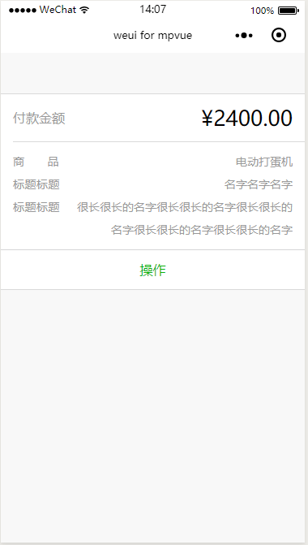

# Preview
预览

`preview` 用于实现表单预览，类似于微信支付账单之类的。表单预览分为 head（`weui-form-preview__hd`），body（`weui-form-preview__bd`）和 foot（`weui-form-preview__ft`）这三大部分，因此实现这一功能加上`weui.css`的一些类即可，示例代码如下：

``` vue
<template>
  <div class="page">
    <div class="weui-form-preview">
      <div class="weui-form-preview__hd">
        <div class="weui-form-preview__item">
          <div class="weui-form-preview__label">付款金额</div>
          <div class="weui-form-preview__value_in-hd">¥2400.00</div>
        </div>
      </div>
      <div class="weui-form-preview__bd">
        <div class="weui-form-preview__item">
          <div class="weui-form-preview__label">商品</div>
          <div class="weui-form-preview__value">电动打蛋机</div>
        </div>
        <div class="weui-form-preview__item">
          <div class="weui-form-preview__label">标题标题</div>
          <div class="weui-form-preview__value">名字名字名字</div>
        </div>
        <div class="weui-form-preview__item">
          <div class="weui-form-preview__label">标题标题</div>
          <div class="weui-form-preview__value">很长很长的名字很长很长的名字很长很长的名字很长很长的名字很长很长的名字</div>
        </div>
      </div>
      <div class="weui-form-preview__ft">
        <navigator url="" class="weui-form-preview__btn weui-form-preview__btn_primary" hover-class="weui-form-preview__btn_active">操作</navigator>
      </div>
    </div>
  </div>
</template>

<script>
import base64 from '../../../static/images/base64';
export default {
  data() {
    return {
      icon60: base64.icon60
    }
  },
}
</script>

<style>
page {
  margin-top: 50px;
}
</style>

```

**效果**




