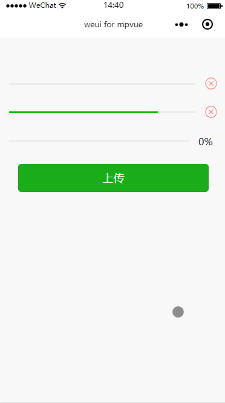

# Progress
进度条

`Progress`，进度条，用于上传、下载等耗时并且需要显示进度的场景，用户可以随时中断该操作。在`mpvue`框架中实现这个功能是基于小程序的原生`progress` 组件，这里主要说一下它`percent`属性：

#### percent
* 类型：Float
* 默认值：无
* 可选值：0-100
* 说明：百分比0~100

要实现上传或者下载过程中显示进度的效果，就需要实时修改 `percent`属性的值，下面示例代码是每隔 20ms 将`percent`的值加1：

``` vue
<template>
  <div class="page">
    <div class="weui-progress">
      <div class="weui-progress__bar">
        <progress percent="0" stroke-width="3" />
      </div>
      <div class="weui-progress__opr">
        <icon type="cancel" size="22"></icon>
      </div>
    </div>
    <div class="weui-progress">
      <div class="weui-progress__bar">
        <progress percent="80" stroke-width="3" />
      </div>
      <div class="weui-progress__opr">
        <icon type="cancel" size="22"></icon>
      </div>
    </div>
    <div class="weui-progress">
      <div class="weui-progress__bar">
        <progress :percent="progress" stroke-width="3" show-info="true"/>
      </div>
    </div>
    <div class="weui-btn-area">
      <button type="primary" @click="upload" :disabled="disabled">上传</button>
    </div>
  </div>
</template>

<script>
import base64 from '../../../static/images/base64';
export default {
  data() {
    return {
      progress: 0,
      disabled: false
    }
  },
  mounted() {

  },
  methods: {
    upload() {
      if (this.disabled) return;
      this.progress = 0;
      this.disabled = true;
      this._next.call(this);
    },

    _next() {
      var _this = this;
      if (_this.progress >= 100) {
        _this.disabled = false;
        return true;
      }
      _this.progress++
      setTimeout(function () {
        _this._next.call(_this);
      }, 20);
    }
  }

}
</script>

<style>
page {
  margin-top: 50px;
  padding: 15px;
  box-sizing: border-box;
}
.weui-progress {
  margin-bottom: 25px;
}
</style>


```

从上面代码可以看出：点击上传按钮后，如果按钮还是可点击状态，就终止，否则执行`_next`函数，在`_next`函数中，如果`percent`的值大于100，就 `return`,否则每隔 20ms `percent`自增 1。在实际开发中，可根据实时返回的数据对 `progress`组件的`value`属性值进行实时渲染。

**效果**


