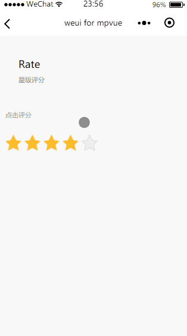

# Rate
星级评分

`Rate` 组件使用 `html5` 中 `data-` 属性实现，当点击评分区域时，获取 `data` 属性的值，然后通过 `vue` 中 `:class` 控制评分星星的状态，即是否为 `active`。

``` vue
<template>
    <div class="page__bd">
      <div class="weui-cells__title">点击评分</div>
      <div class="weui-cells__title">{{rateScore}}</div>
      <div class="weui-rate-wrap">
        <ul class="weui-rate">
          <li class="weui-rate-item" v-for="n in max" :key="index" :class="{'weui-rate-item-active' : index <= tempValue}" :data-index='index' @click="selectRate">
            <div class="weui-rate-item-def"></div>
          </li>
        </ul>
      </div>
    </div>
  </div>
</template>

<script>
export default {
  data() {
    return {
      max: 5,
      rateScore: '',
      rateScoreDesc: ['非常不满意，各方面都很差', '不满意，比较差', '一般，还需改善', '比较满意，仍可改善', '非常满意,无可挑剔'],
      tempValue: 3
    }
  },
  methods: {
    selectRate(e) {
      this.tempValue = e.mp.currentTarget.dataset.index;
      this.rateScore = this.rateScoreDesc[this.tempValue];
    }
  }
}
</script>

<style>
</style>

```

**效果**

