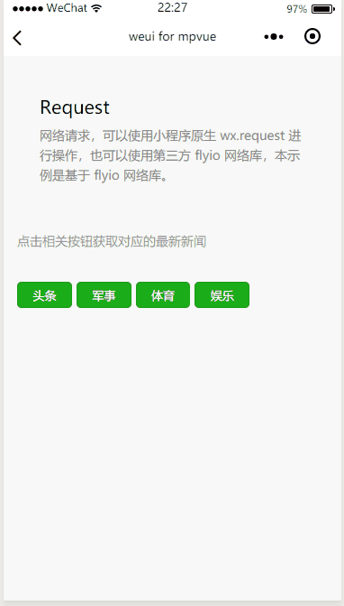

# Request

网络请求

request 指的是小程序中的网络请求，在 `mpvue` 框架中可以通过小程序提供的原生 API `wx.request` 来进行相关的处理。但是在这里推荐一个第三方的网络请求库 [fly](https://github.com/wendux/fly)。之所以推荐这个第三方库，是因为可以在多个端上实现代码的复用，目前已支持的有 `Node.js` 、`微信小程序` 、`Weex` 、`React Native` 、`Quick App`。

### 在 mpvue 中如何使用 

##### 安装

``` bash
npm install flyio   ||   cnpm install flyio
```

##### 引入

``` javascript
import Fly from "flyio/dist/npm/wx";
```

##### 使用

**1. 创建一个 fly 实例**

``` javascript
let fly = new Fly;
```

**2. 发起GET请求**

``` javascript
//通过用户id获取信息,参数直接写在url中
fly.get('/user?id=133')
  .then(function (response) {
    console.log(response);
  })
  .catch(function (error) {
    console.log(error);
  });

//query参数通过对象传递
fly.get('/user', {
      id: 133
  })
  .then(function (response) {
    console.log(response);
  })
  .catch(function (error) {
    console.log(error);
  });
```

**3. 发起POST请求**

``` javascript
fly.post('/user', {
    name: 'Doris',
    age: 24
    phone:"18513222525"
  })
  .then(function (response) {
    console.log(response);
  })
  .catch(function (error) {
    console.log(error);
  });
```

**4. 发起多个并发请求**

``` javascript
function getUserRecords() {
  return fly.get('/user/133/records');
}

function getUserProjects() {
  return fly.get('/user/133/projects');
}

fly.all([getUserRecords(), getUserProjects()])
  .then(fly.spread(function (records, projects) {
    //两个请求都完成
  }))
  .catch(function(error){
    console.log(error)
  })
```

**5. 直接通过 `request` 接口发起请求**

``` javascript
//直接调用request函数发起post请求
fly.request("/test",{hh:5},{
    method:"post",
    timeout:5000 //超时设置为5s
 })
.then(d=>{ console.log("request result:",d)})
.catch((e) => console.log("error", e))
```

**更多请求方法与实例可前往 [fly 中文文档](https://github.com/wendux/fly/blob/master/README-CH.md) 查看**

##### 效果

