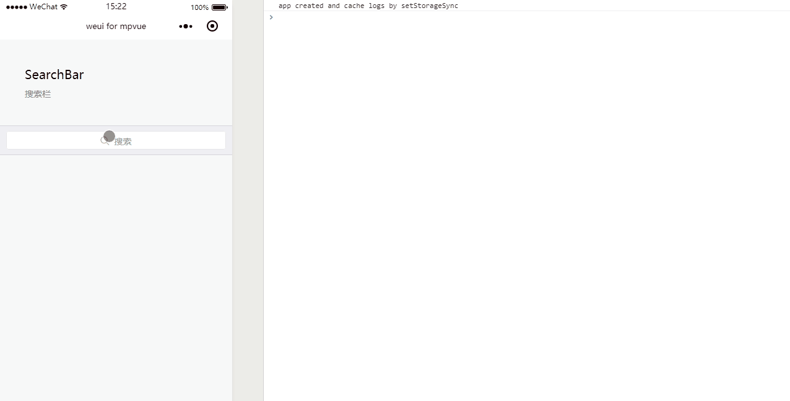

# Search
搜索栏

`search`这部分是利用小程序`input`组件实现，在下面的示例中主要使用了`focus`和`bindinput`两个属性，由于`mpvue`从底层支持 Vue.js 语法和构建工具体系，因此可以用`vue`的`v-model`进行双向数据绑定，示例如下：

``` vue
<template>
  <div class="page">
    <div class="page__hd">
      <div class="page__title">SearchBar</div>
      <div class="page__desc">搜索栏</div>
    </div>
    <div class="page__bd">
      <div class="weui-search-bar">
        <div class="weui-search-bar__form">
          <div class="weui-search-bar__box">
            <icon class="weui-icon-search_in-box" type="search" size="14"></icon>
            <input type="text" class="weui-search-bar__input" placeholder="搜索" v-model="inputVal" :focus="inputShowed" @input="inputTyping" />
            <div class="weui-icon-clear" v-if="inputVal.length > 0" @click="clearInput">
              <icon type="clear" size="14"></icon>
            </div>
          </div>
          <label class="weui-search-bar__label" :hidden="inputShowed" @click="showInput">
            <icon class="weui-icon-search" type="search" size="14"></icon>
            <div class="weui-search-bar__text">搜索</div>
          </label>
        </div>
        <div class="weui-search-bar__cancel-btn" :hidden="!inputShowed" @click="hideInput">取消</div>
      </div>
      <div class="weui-cells searchbar-result" v-if="inputVal.length > 0">
        <navigator url="" class="weui-cell" hover-class="weui-cell_active">
          <div class="weui-cell__bd">
            <div>实时搜索文本</div>
          </div>
        </navigator>
        <navigator url="" class="weui-cell" hover-class="weui-cell_active">
          <div class="weui-cell__bd">
            <div>实时搜索文本</div>
          </div>
        </navigator>
        <navigator url="" class="weui-cell" hover-class="weui-cell_active">
          <div class="weui-cell__bd">
            <div>实时搜索文本</div>
          </div>
        </navigator>
        <navigator url="" class="weui-cell" hover-class="weui-cell_active">
          <div class="weui-cell__bd">
            <div>实时搜索文本</div>
          </div>
        </navigator>
      </div>
    </div>
  </div>
</template>

<script>
export default {
  data() {
    return {
      inputShowed: false,
      inputVal: ""
    }
  },
  methods: {
    showInput() {
      this.inputShowed = true;
    },
    hideInput() {
      this.inputVal = '';
      this.inputShowed = false
    },
    clearInput() {
      this.inputVal = '';
    },
    inputTyping(e) {
      console.log(e);
      this.inputVal = e.mp.detail.value
    }
  }
}
</script>

<style scoped>
.searchbar-result {
  margin-top: 0;
  font-size: 14px;
}
.searchbar-result:before {
  display: none;
}
.weui-cell {
  padding: 12px 15px 12px 35px;
}
</style>

```

**效果**


