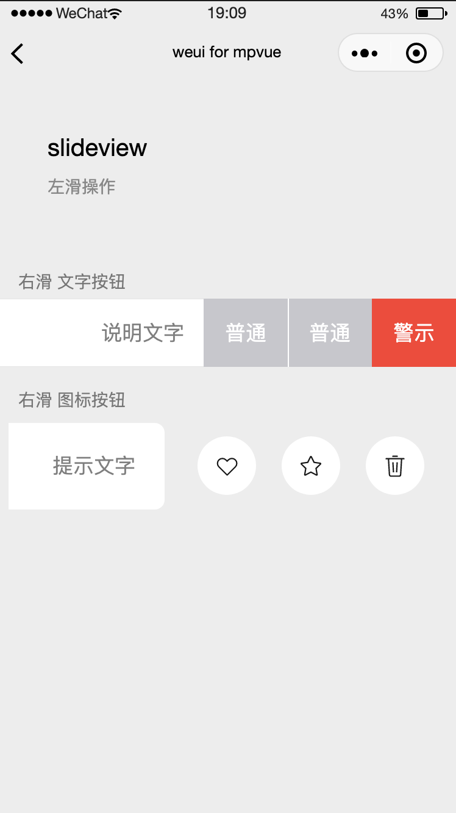

# SlideView

左滑操作

示例代码如下：

```vue
<view class="weui-slideview">
  <view class="weui-slideview__left" style="transform:translateX(-207px);">
    <view class="weui-cell">
      <view class="weui-cell__bd">标题文字</view>
      <view class="weui-cell__ft">说明文字</view>
    </view>
  </view>
  <view class="weui-slideview__right" style="width:207px;line-height:56px;">
    <view class="weui-slideview__buttons">
      <view
        class="weui-slideview__btn__wrp weui-slideview__btn-group_default"
        style="transform:translateX(-207px);"
      >
        <view class="weui-slideview__btn">普通</view>
      </view>
      <view
        class="weui-slideview__btn__wrp weui-slideview__btn-group_default"
        style="transform:translateX(-138px);"
      >
        <view class="weui-slideview__btn">普通</view>
      </view>
      <view
        class="weui-slideview__btn__wrp weui-slideview__btn-group_warn"
        style="transform:translateX(-69px);"
      >
        <view class="weui-slideview__btn">警示</view>
      </view>
    </view>
  </view>
</view>
```

**效果**



