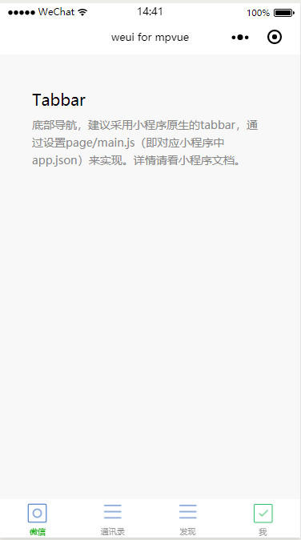

# Tabbar
底部导航

实现`tabbar`建议采用小程序原生的tabbar，通过设置page/main.js（即对应小程序中app.json）来实现，详情请看小程序文档。示例如下，仅作参考：

``` javascript
tabBar: {
  color: '#999999',
  selectedColor: '#1AAD16',
  backgroundColor: '#ffffff',
  borderStyle: 'white',
  /* eslint-disable */
  list: [{
      pagePath: 'pages/tabbar/tabbar',
      text: '微信',
      iconPath: 'static/images/icon_nav_button.png',
      selectedIconPath: 'static/images/icon_nav_button.png'
    },
    {
      pagePath: 'pages/tabbar/tabbar',
      text: '通讯录',
      iconPath: 'static/images/icon_nav_cell.png',
      selectedIconPath: 'static/images/icon_nav_cell.png'
    },
    {
      pagePath: 'pages/tabbar/tabbar',
      text: '发现',
      iconPath: 'static/images/icon_nav_cell.png',
      selectedIconPath: 'static/images/icon_nav_cell.png'
    },
    {
      pagePath: 'pages/tabbar/tabbar',
      text: '我',
      iconPath: 'static/images/icon_nav_toast.png',
      selectedIconPath: 'static/images/icon_nav_toast.png'
    }
  ]
  /* eslint-enable */
}
```
**效果**


