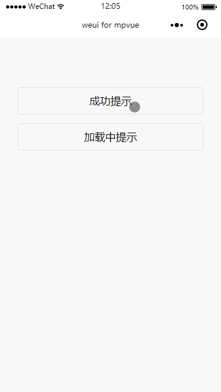

#  Toast
提示

toast 用于临时显示某些信息，并且会在数秒后自动消失。这里使用小程序原生 API `wx.showToast(OBJECT)`来完成。不过有个哥们自己写了一个基于 `mpvue`框架的一个`toast`组件，详情请点 [mpvue-toast](https://github.com/linrui1994/mpvue-toast)。在`mpvue`框架中使用`wx.showToast(OBJECT)`实现如下：

``` vue
<template>
  <div class="page">
    <div class="weui-btn-area">
      <button class="weui-btn" type="default" @click="openToast">成功提示</button>
      <button class="weui-btn" type="default" @click="openLoading">加载中提示</button>
    </div>
  </div>
</template>

<script>
import base64 from '../../../static/images/base64';
export default {
  data() {
    return {
    }
  },
  methods: {
    openToast() {
      wx.showToast({
        title: '已完成',
        icon: 'success',
        duration: 3000,
        mask: true
      });
    },
    openLoading() {
      wx.showToast({
        title: '数据加载中',
        icon: 'loading',
        duration: 3000,
        mask: true
      });
    }
  }
}
</script>

<style>
page {
  margin-top: 50px;
  padding: 15px;
  box-sizing: border-box;
}
</style>

```
**OBJECT参数** 的配置可参考小程序官方文档，这些参数在`mpvue`框架中完全支持。

**效果**


