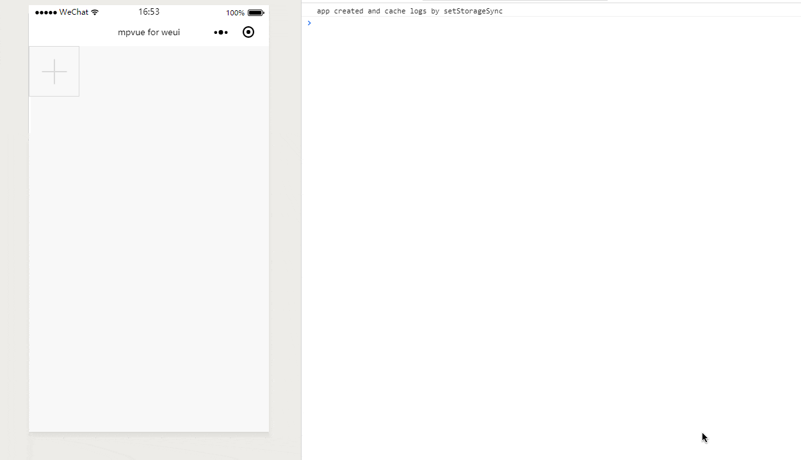
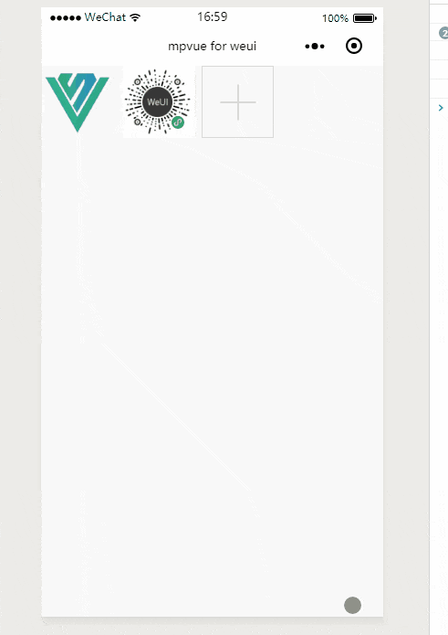

# Uploader
图片上传

## 图片上传
图片上传的实现主要使用了微信原生API `wx.chooseImage(OBJECT)`

``` vue
<template>
  <div class="page">
    <div class="weui-uploader__bd">
      <div class="weui-uploader__files" id="uploaderFiles">
        <block v-for="item in files" :key="index">
          <div class="weui-uploader__file" @click="predivImage" :id="item">
            <image class="weui-uploader__img" :src="item" mode="aspectFill" />
          </div>
        </block>
      </div>
      <div class="weui-uploader__input-box">
        <div class="weui-uploader__input" @click="chooseImage"></div>
      </div>
    </div>
  </div>
  </div>
</template>

<script>
export default {
  data() {
    return {
      files: []
    }
  },
  methods: {
    chooseImage(e) {
      var _this = this;
      wx.chooseImage({
        sizeType: ['original', 'compressed'], // 可以指定是原图还是压缩图，默认二者都有
        sourceType: ['album', 'camera'], // 可以指定来源是相册还是相机，默认二者都有
        success: function (res) {
          // 返回选定照片的本地文件路径列表，tempFilePath可以作为img标签的src属性显示图片
          _this.files = _this.files.concat(res.tempFilePaths)
        },
        fail: function () {
          console.log('fail');
        },
        complete: function () {
          console.log('commplete');
        }
      })
    },
    predivImage(e) {
      console.log(e);
      wx.previewImage({
        current: e.currentTarget.id, // 当前显示图片的http链接
        urls: this.files // 需要预览的图片http链接列表
      })
    }
  }
}
</script>

<style>

</style>

```

**效果**



## 图片预览

图片预览的实现主要使用了微信原生API `wx.previewImage(OBJECT)`

``` vue
<script>
export default {
  data() {
    return {
      files: []
    }
  },
  methods: {
    predivImage(e) {
      console.log(e);
      wx.previewImage({
        current: e.currentTarget.id, // 当前显示图片的http链接
        urls: this.files // 需要预览的图片http链接列表
      })
    }
  }
}
</script>
```

**效果**



