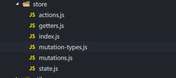
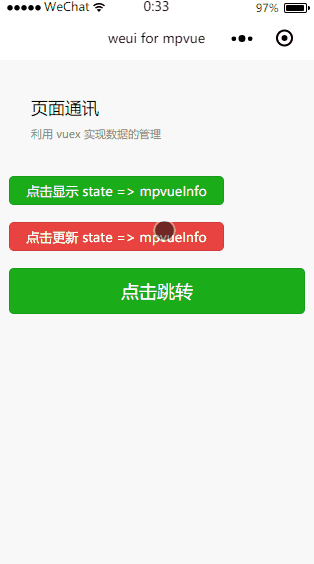

# 页面通信
页面通信

该示例为小程序间的页面通讯，利用 vuex 实现。

在 `mpvue`框架中使用 `vuex` 与在 `vue` 中使用是一样的体验。

1.建立相关的目录结构



2.在 src/main.js 中将 store 挂载到 vue 原型下面

``` javascript
Vue.prototype.$store = store;
```

3.在页面中通过 mapGetters 和 mapMutations 使用 state

``` javascript
  methods: {
    ...mapMutations({
      setMpvueInfoVuex: 'SET_MPVUEINFO'
    })
  },

  computed: {
    ...mapGetters([
      'mpvueInfo'
    ])
  }
```

**效果**

